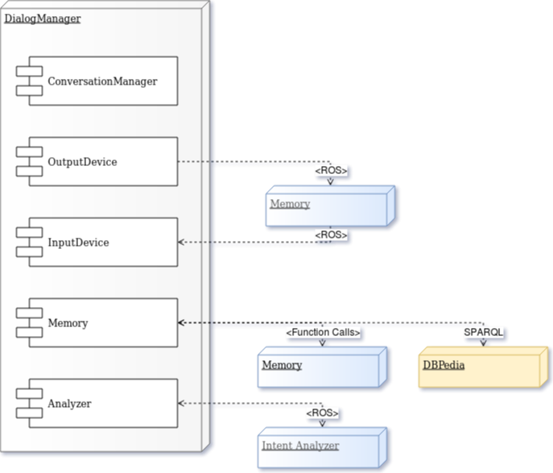

Deployment diagram
==================

This diagram depicts the external modules and their communication channels/protocols with the Dialog Manager. Modules which are in development (intents, Memory) are included in gray. For simplicity, the Dialog Manager module only contains these components which are most relevant for external connections.

