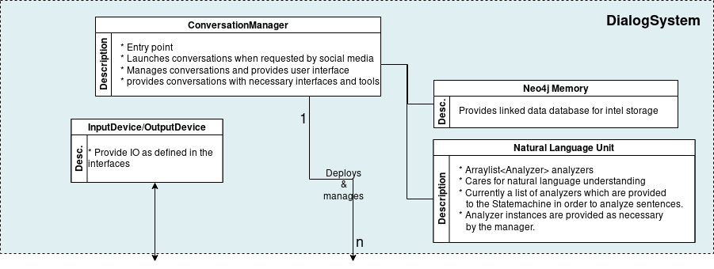

**********************
The Dialog System Core
**********************

The Dialog System Core takes care of spawning, deleting and managing *Conversations*, initializing and providing all necessary static core features and services like the memory, the NLU, Statemachine, etc. to *Conversations*.
Its heart is the *ConversationManager*, which is accompanied by the external services of *Memory* and *NLU* and the *InputDevices* and *OutputDevices* which provide interfaces to communication channels which we call *World Interfaces*, since the Roboy Dialog System may interface the world through these.

:alt: Dialog System Core architecture

-------------------
ConversationManager
-------------------

The ``roboy.dialog.ConversationManager`` is the central managing node for the Dialog System. It is the entry point of the program. When ``roboy.dialog.ConversationManager.main()`` is launched, it initializes all necessary modules and then enters control-mode, where it assumes a behaviour depending on the selected *InputDevice* in order to provide control over the *Conversations*.

**Initializing** includes initializing the ROS node, initializing ``roboy.linguistics.sentenceanalysis.Analyzer`` classes from the *NLU* and placing them in a List so they may be invoked by the *Conversations* in a correct order.

**In order to manage *Conversations*** it stores them by UUID, which is in the format "[world-interface-name]-[uuid-from-world-interface", for example "telegram-aaaaaaaaaaaa". Then it provides an API consisting of methods that allow controlling the *Conversation* threads if you know their uuid. It allows creating and spawning new *Conversations* and restarting, stopping and pausing existing ones. Also it allows deregistering *Conversations* so they can properly be destroyed when they are over.

--------------------------
InputDevice & OutputDevice
--------------------------

The ``roboy.dialog.io.InputDevice`` and ``roboy.dialog.OutputDevice`` classes are interfaces that may be used to provide *World Interfaces* to the Roboy Dialog System. Their actual behaviour depends on the architecture of the system that should be interfaced.

**In order for input to be handled by the *Conversations***, an implemnetation of ``roboy.dialog.io.InputDevice`` must provide a ``public Input listen()`` method. A *Conversation* Thread will call this function in order to recieve a new ``roboy.dialog.io.Input``. If no new input has been generated by the user, the thread should wait inside the ``listen()`` function until a new input is generated.

**To enable a Conversation to send output to a channel**, an implementation of ``roboy.dialog.io.OutputDevice`` must provide a ``public void act(List<Action> actions)`` which should process the different types of ``roboy.dialog.action.Action`` according to the capabilites of the communication channel.

**If an InputDevice or OutputDevice needs static or external action when it gets destroyed** it should implement ``roboy.dialog.io.CleanUp``. An example for this is ``roboy.dialog.io.TelegramInput``.

---------------------
NLU (Semantic Parser)
---------------------

    Semantic parser is used to translate text representation into formal language representation. The aim is to be able to process user utterances and react upon them.

    roboy_parser is based on `SEMPRE <http://nlp.stanford.edu/software/sempre/>`. It is currently being modified to fulfill Roboy Dialog system needs.

    Installation
    ^^^^^^^^^^^^

    In order to use semantic parser, you need to:

    - clone ``roboy_parser`` repository::

        git clone http://github.com/Roboy/roboy_parser

    - navigate to created repository::

        cd roboy_parser

    - download dependencies::

        ./pull-dependencies roboy

    - build it::

        mvn clean
        mvn install

    - run it::

        mvn exec:java -Dexec.mainClass=edu.stanford.nlp.sempre.Main

    Architecture
    ^^^^^^^^^^^^

    Semantic parser is based on the language model and NLP algorithms that then apply rules to the utterance to translate it. Language model consists of:
    - set of grammar rules,
    - lexicon,
    - training dataset.

    General architecture can be seen on the diagram below.

    .. figure:: ../images/parser.png
    :alt: Semantic parser general architecture

    Implementation
    ^^^^^^^^^^^^^^

    roboy_parser is a separate Java project and is communicating using ``WebSocket``. Dialog system has a client implemented in ``SemanticParserAnalyzer.java`` class. It is therefore part of Natural Language Understanding unit.

    Current parser was modified from SEMPRE and currently has following components

    .. figure:: ../images/PARSER_arch.png
    :alt: Semantic parser components

    Functionalities
    """""""""""""""

    Roboy parser currently has currently following functionalities:

    .. csv-table:: Semantic Parser algorithms used
    :header: "Functionality", "Software used", "Summary"
      :widths: 20, 20, 60

          "Tokens", "OpenNLP", "Tokenized utterance"
          "POS Tags", "OpenNLP", "Tagging tokens as part of speech"
          "NER Tags", "OpenNLP", "Tool used to tag named entities like PERSON, NUMBER, ORGANIZATION"
          "Triple extraction", "OpenIE", "Tool used to extract triples from sentences in form ``(Subject,Predicate,Object)``"
      "Parser result", "Parser", "Logical representation of an utterance"
      "Parser answer", "Parser", "Answer for resulting parser result"
      "Follow-up", "Parser", "Follow-up questions for underspecified term"

    Usage
    ^^^^^

    In order to run the parser, you need to run **roboy_parser** first - see instructions on `project Github <http://github.com/Roboy/roboy_parser>` and then run Dialog System.

    Configurations
    """"""""""""""

    To test parser, you can run following execution configurations using ``maven``. For more information refer to `project documentation <http://github.com/Roboy/roboy_parser>`

    .. csv-table:: Possible parser configurations
    :header: "Command", "Options"
      :widths: 20, 40

            "interactive", "Standard lexicon and grammar, communication over terminal. Does not load all the models ahead. Error retrieval enabled."
            "demo-error", "Standard lexicon and grammar, communication over socket. Loads all the models ahead. Error retrieval enabled"
            "demo", "Standard lexicon and grammar, communication over socket. Loads all the models ahead. Error retrieval disabled"
            "debug", "Standard lexicon and grammar, communication over server (web page available). Does not load all the models ahead. Error retrieval enabled"

--------------------------
Memory (The memory module)
--------------------------

    General design
    ^^^^^^^^^^^^^^

    To remember information about itself and its conversation partners, their hobbies, occupations and origin, a persistent Memory module has been implemented using the Neo4j graph database.

    Implementation
    ^^^^^^^^^^^^^^

    Roboy's Dialog System interactions with the Memory module (`learn more <http://roboy-memory.readthedocs.io/>`_) are based on ROS messages.
    The messages are sent using the methods in ``de.roboy.ros.RosMainNode``, which implements the four query types based on the specified Memory services:

    +--------------------+--------------------------------------------------+
    | Method name        | Description                                      |
    +====================+==================================================+
    | CreateMemoryQuery  | Creates a node in Memory database                |
    +--------------------+--------------------------------------------------+
    | UpdateMemoryQuery  | Adds or changes information of an existing node  |
    +--------------------+--------------------------------------------------+
    | GetMemoryQuery     | Retrieves either one node or an array of IDs     |
    +--------------------+--------------------------------------------------+
    | DeleteMemoryQuery  | Removes information from or deletes a node       |
    +--------------------+--------------------------------------------------+
    | CypherMemoryQuery  | For more complex queries (future)                |
    +--------------------+--------------------------------------------------+

    The messages received from Memory are in JSON format. To enable flexible high-level handling of Memory information, two classes were created to incorporate the node structures and logic inside the Dialog System. The ``de.roboy.memory.nodes.MemoryNodeModel`` contains the labels, properties and relationships in a format which can be directly parsed from and into JSON. For this, Dialog is using the GSON parsing methods which enable direct translation of a JSON String into its respective Java class representation.

    Methods such as ``getRelation()`` or ``setProperties()`` were implemented to allow intuitive handling of the MemoryNodeModel instances. A separate class, ``de.roboy.memory.nodes.Interlocutor``, encapsulates a MemoryNodeModel and is intended to further ease saving information about the current conversation partner of Roboy. Interlocutor goes one step further by also abstracting the actual calls to memory, such that adding the name of the conversant performs an automatic lookup in the memory with subsequent updating of the person-related information. This is then available in all subsequent interactions, such that Roboy can refrain from asking questions twice, or refer to information he rememberes from earlier conversations.
