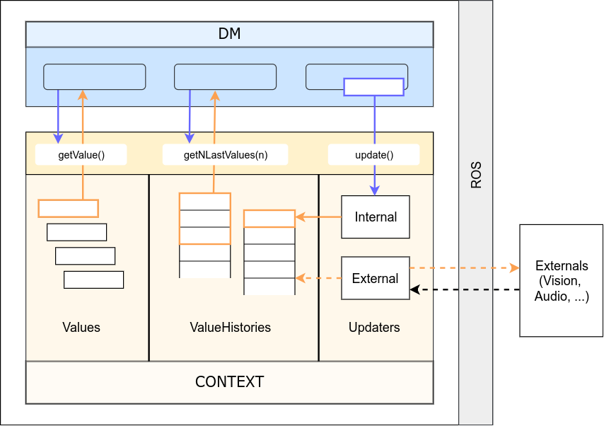

.. _context:

*******
Context
*******

The goal of Context is to collect information about Roboy's or a conversation's environment and state. This information can be used by the dialog manager and also to react upon situations that match certain conditions, such as turning the head of Roboy when the Interlocutor moves.

Architecture
============

The Context supports storing data as a ``Value`` or ``ValueHistory``. A ``Value`` only stores the latest data object that was pushed to it. A ``ValueHistory`` stores every value it receives and assigns each a unique key, thus the values can be ordered by their adding time.

How to add Values?
==================

Here we describe how a new Value can be created and added to the Context. Sample implementations can be found inside ``roboy.context.contextObjects`` package.

1. Consider what type of data will be stored in the Value. For this example, we chose ``String``.

2. In the ``contextObjects`` directory, create a new class which inherits from the Value class. The final signature should look similar to: ``public class SampleValue extends Value<String>`` (replacing String with your type).

3. Make the value available for the Dialog System by defining a ``ValueInterface`` in the ``Context.java`` class, among other class variables. A ``ValueInterface`` takes two type parameters: the ``Value`` class created in step 2, and its data type (in our case, ``String``). Example: ``public final ValueInterface<SampleValue, String> SAMPLE_VALUE = new ValueInterface<>(new SampleValue());``

4. Congratulations, you can now query the new Value object! ...but it does not receive any values yet. To change this, see "How to add Updaters?" below.

How to add ValueHistories?
==========================

ValueHistories extend the functionality of Values by storing all data objects sent to them. Over the ``getNLastValues(int n)`` method, a map with several most recent data objects can be retrieved, including their ordering. The ``contains(V value)`` method checks whether an object is currently found in the history - note that ValueHistories have size limits, therefore oldest values disappear from the history when new ones are added.

Adding a ``ValueHistory`` is very much alike to adding a ``Value``, just make sure to:

1. extend ``ValueHistory<>`` instead of ``Value<>``. If the history should keep more than the default 50 values, override the getMaxLimit() method to return your desired limit value.

2. in ``Context.java``, create a ``HistoryInterface`` instead of ``ValueInterface``.

How to add Updaters?
====================

New values can only flow into the Context over an ``Updater`` instance. Internal Updaters can be used by the dialog manager to actively add new values. External Updaters run in separate threads and query or listen for new values, for example over a ROS connection.

Updaters only add a single new data unit, relying on the ``AbstractValue.updateValue()`` method. Thanks to the inheritance chain, you can use an arbitrary Value or ValueHistory implementation as the target of an updater.

Adding an External Updater
""""""""""""""""""""""""""
Currently, there are two implementations of an External Updater: ``PeriodicUpdater`` and ``ROSTopicUpdater``.

``PeriodicUpdater`` calls an updating method after a certain time interval has passed. To use the periodic updating functionality:

1. Create a class extending ``PeriodicUpdater`` and implement its ``update()`` method. It should retrieve the values and finally add them over the ``target.updateValue(value)`` method call.

2. A constructor is required for the class. Simply match the PeriodicUpdater constructor and call ``super(target)`` within - or use the two-parameter constructor to change the update frequency (by default 1 second).

``ROSTopicUpdater`` subscribes itself to a ROS Topic and reacts to messages coming from the topic. To use:

1. Create a class extending ``ROSTopicUpdater`` and define the ``getTargetSubscriber()`` method, which will point the updater towards its target ROS topic. The options for the subscriber can be found in the ``RosSubscribers.java`` class.

2. Implement the ``update()`` method of the new class. This method will be called whenever a new message is stored in the internal ``message`` variable, so it might be enough to just call ``target.updateValue(message)``. If the data needs to be extracted from the message first, do it in the ``update()`` before calling ``target.updateValue``.

All External Updaters need to be initialized in the ``Context.java`` class. To do this:

1. Define the External Updater a private class variable to the ``Context.java`` class (look for the external updater definition section).

4. If the Updater depends on ROS, add its initialization into the ``Context.initializeROS(RosMainNode ros)`` method, otherwise add it to the private constructor ``Context()``. As the parameter, use the inner ``value`` or ``valueHistory`` variable from a ``ValueInterface`` or a ``HistoryInterface``.

Adding a new Internal Updater
"""""""""""""""""""""""""""""
1. Create a class extending InternalUpdater<*targetClass*, *valueType*>. The class and data type of the target ``Value`` or ``ValueHistory`` are the generic parameters for the updater.

2. A constructor is required for the class. Simply match the InternalUpdater constructor and call ``super(target)`` within. An example is in the ``DialogTopicsUpdater`` class.

4. Define the Internal Updater in the ``Context.java`` class. Initialize the updater within the private ``Context()`` constructor. For example:

``public final SampleUpdater SAMPLE_UPDATER; // Define as class variable``

``SAMPLE_UPDATER = new SampleUpdater(DIALOG_TOPICS.valueHistory); // Initialize in the constructor``