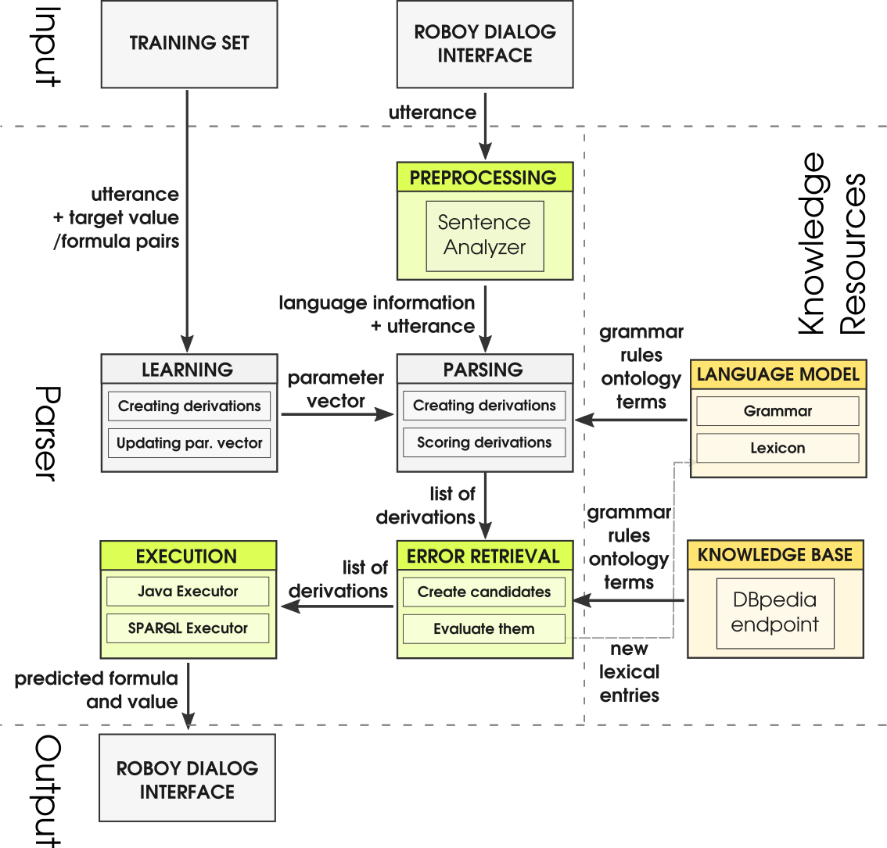

*******************************
Libraries and External Software
*******************************

Contains a list of the libraries and external software used by this system.

.. _The Roboy Parser:

The Roboy Parser
================

Implementation
--------------

roboy_parser is a separate Java project and is communicating using ``WebSocket``. Dialog system has a client implemented in ``SemanticParserAnalyzer.java`` class. It is therefore part of Natural Language Understanding unit.

For full documentation please refer the roboy parser docs acessible through the `roboy parser github repository <http://github.com/Roboy/roboy_parser>`_.

Current parser was modified from SEMPRE and currently has following components

Functionalities
"""""""""""""""

Roboy parser currently has currently following functionalities:

.. csv-table:: Semantic Parser algorithms used
  :header: "Functionality", "Software used", "Summary"
  :widths: 20, 20, 60

  "Tokens", "OpenNLP", "Tokenized utterance"
  "POS Tags", "OpenNLP", "Tagging tokens as part of speech"
  "NER Tags", "OpenNLP", "Tool used to tag named entities like PERSON, NUMBER, ORGANIZATION"
  "Triple extraction", "OpenIE", "Tool used to extract triples from sentences in form ``(Subject,Predicate,Object)``"
  "Parser result", "Parser", "Logical representation of an utterance"
  "Parser answer", "Parser", "Answer for resulting parser result"
  "Follow-up", "Parser", "Follow-up questions for underspecified term"

Usage
-----

In order to run the parser, you need to run **roboy_parser** first - see instructions on `project Github <http://github.com/Roboy/roboy_parser>` and then run Dialog System.

Configurations
""""""""""""""

To test parser, you can run following execution configurations using ``maven``. For more information refer to `project documentation <http://github.com/Roboy/roboy_parser>`

.. csv-table:: Possible parser configurations
  :header: "Command", "Options"
  :widths: 20, 40

  "interactive", "Standard lexicon and grammar, communication over terminal. Does not load all the models ahead. Error retrieval enabled."
  "demo-error", "Standard lexicon and grammar, communication over socket. Loads all the models ahead. Error retrieval enabled"
  "demo", "Standard lexicon and grammar, communication over socket. Loads all the models ahead. Error retrieval disabled"
  "debug", "Standard lexicon and grammar, communication over server (web page available). Does not load all the models ahead. Error retrieval enabled"

.. _Roboy memory:

Roboy Memory
============

Implementation
--------------

Roboy's Dialog System interactions with the Memory module (`learn more <http://roboy-memory.readthedocs.io/>`_) are based on ROS messages.
The messages are sent using the methods in ``de.roboy.ros.RosMainNode``, which implements the four query types based on the specified Memory services:

+--------------------+--------------------------------------------------+
| Method name        | Description                                      |
+====================+==================================================+
| CreateMemoryQuery  | Creates a node in Memory database                |
+--------------------+--------------------------------------------------+
| UpdateMemoryQuery  | Adds or changes information of an existing node  |
+--------------------+--------------------------------------------------+
| GetMemoryQuery     | Retrieves either one node or an array of IDs     |
+--------------------+--------------------------------------------------+
| DeleteMemoryQuery  | Removes information from or deletes a node       |
+--------------------+--------------------------------------------------+
| CypherMemoryQuery  | For more complex queries (future)                |
+--------------------+--------------------------------------------------+

The messages received from Memory are in JSON format. To enable flexible high-level handling of Memory information, two classes were created to incorporate the node structures and logic inside the Dialog System. The ``de.roboy.memory.nodes.MemoryNodeModel`` contains the labels, properties and relationships in a format which can be directly parsed from and into JSON. For this, Dialog is using the GSON parsing methods which enable direct translation of a JSON String into its respective Java class representation.

Methods such as ``getRelation()`` or ``setProperties()`` were implemented to allow intuitive handling of the MemoryNodeModel instances. A separate class, ``de.roboy.memory.nodes.Interlocutor``, encapsulates a MemoryNodeModel and is intended to further ease saving information about the current conversation partner of Roboy. Interlocutor goes one step further by also abstracting the actual calls to memory, such that adding the name of the conversant performs an automatic lookup in the memory with subsequent updating of the person-related information. This is then available in all subsequent interactions, such that Roboy can refrain from asking questions twice, or refer to information he rememberes from earlier conversations.

Other
=====

TelegramBots Library
--------------------

To receive and send messages the library in the following github link has been used: https://github.com/rubenlagus/TelegramBots

.. csv-table:: Libraries and external Software
  :header: "Name", "URL/Author", "License", Description