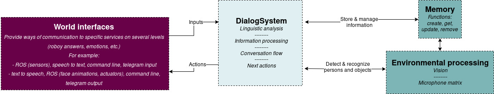

.. Software Documentation template master file, created by
   sphinx-quickstart on Fri Jul 29 19:44:29 2016.
   You can adapt this file completely to your liking, but it should at least
   contain the root `toctree` directive.

Roboy Dialog System
===========================================================

The Roboy Dialog (or Dialog Manager) System (RDS) is a sophisticated software module representing the cognitive capabilities
of the humanoid anthropomimetic robot Roboy.
The goal of the project is to implement dialog routines and knowledge extraction for a realistic human-like
conversation flow which is achieved by utilizing various behaviour models represented by the State Machine (RDSM) finite automaton
defined via a certain Roboy Personality description (file).
Within the particular conversation flow stages, the behavioural variability is obtained by extending and redefining
the common RDSM State to produce a certain social interaction.
The RDMS State both as actor and as reactor regarding the internally formulated output and externally acquired input.
For example, the voice input is processed via the Listening Device -> Speech-to-Text -> Analyzers & Semantic Parser -> Linguistics package
-> (InferenceEngine) -> State sequence.
It also allows being deployed on a multitude of communication channels for a broader interaction audience.

The overview diagram shows the external systems which Dialog System interacts with, and the tasks for which the system is responsible.

Status
------

Stable functionality:

- Roboy introduces himself
- Roboy answers questions about himself
- Roboy answers questions about facts
- Roboy recognizes once someone saying one's name
- Roboy asks questions about people he meets
- Roboy stores and retrieves the information about people he meets
- Roboy stores and retrieves the information about himself

In development:

- Roboy updates the information (name, occupation, ect.) about people he meets
- Roboy updates the information about himself
- Roboy recognizes the intent behind an asked questions (age, creator, capabilities etc.)
- The Roboy Dialog is fully deployable on multiple internet channels.

Relevant Background Information and Pre-Requisites
---------------------------------------------------

A User should be familiar with:

- Roboy Personality Files
- Roboy Context
- Roboy Memory Module
- Roboy Semantic Parser Module
- ROS

A Developer should be familiar with:

- Roboy Personality Files
- Roboy Context
- Roboy Memory Module
- Roboy Communication Protocol
- Roboy Semantic Parser Module
- Java programming language
- Maven automation tool
- ROS
- rosjava
- Sockets

Reading list for a User:

- `rosjava Documentation <http://wiki.ros.org/rosjava>`_

Reading list for a Developer:

- `Java Documentation <http://www.oracle.com/technetwork/topics/newtojava/new2java-141543.html>`_
- `Maven Documentation <https://maven.apache.org/index.html>`_
- `rosjava Documentation <http://wiki.ros.org/rosjava>`_
- `Roboy Memory Module Documentation <http://roboy-memory.readthedocs.io/>`_

Contents:
----------

.. _usage:
.. toctree::
  :maxdepth: 1
  :glob:
  :caption: Usage and Installation

  Usage/*

.. _ScopeContext:
.. toctree::
  :maxdepth: 1
  :glob:
  :caption: Interfaces and Scope

  ScopeContext/*
  
.. _Architecture:
.. toctree::
   :maxdepth: 1
   :glob:
   :caption: Architecture
   
   Architecture/*

.. toctree::
   :maxdepth: 1

   about-arc42
