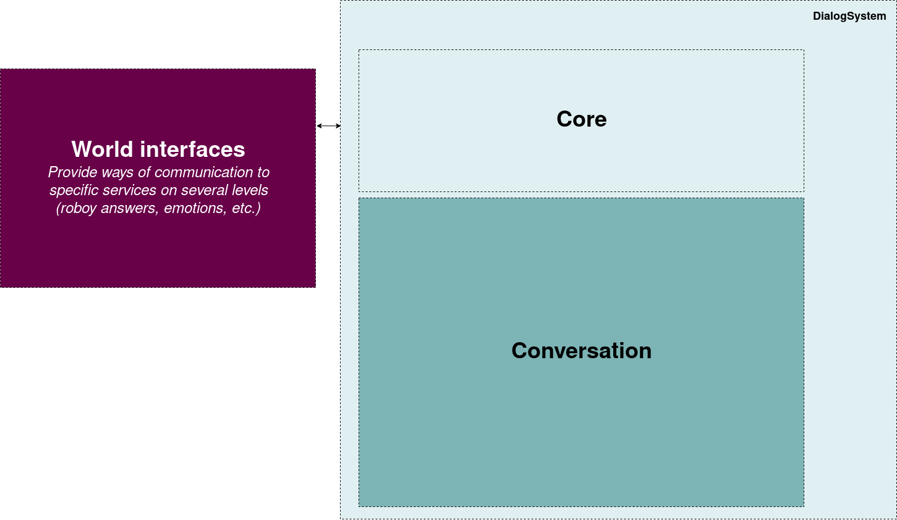

*********************
Architecture overview
*********************

The Roboy Dialog System consists of three interacting parts: The Dialog Systems **`core`_**, which provides infrastructure to each conversation the dialogsystem can have with a user and overall management of the Dialog System, **`conversations`**, which are threads handling per-user interaction and are embedded into the Dialog System and **`world interfaces`_**, which are services and interfaces over which the Roboy Dialog System may communicate with users.

.. _core: :ref:`The Dialog System Core`
.. _conversations: :ref:`Conversation`
.. _world interfaces: :ref:`World Interfaces`

In the figure you may see a simplified overview of the dialog system. Below that, the general functionality of the system is explained. For details see the specific sub-pages of one of the three parts. Although this is a description of the systems architecture, we will mention implementation specific details for easier understanding.

  Click :download:`here <images/architecture_diagram.png>` in order to see the detailed overview partially provided within the subsections.

Conversation flow
=================

In order to understand how the Dialog System works, a basic lifecycle of a *Conversation* is drawn here exemplary:

**When the Dialog System is started**, the *ConversationManager* initializes the Dialog Systems *Memory*, the *NLU* and the configured *InputDevice*. The *InputDevice* then starts listening to it's service.

**Input from an unknown user** will be handled by the InputDevice. Typically, it should make the *ConversationManager* spawn a new *Conversation* and then direct the users input to this new *Conversation*.

**Input into a running conversation** will be taken by the waiting *Conversation* thread and then processed using the *NLU*. This processing includes interpreting it, invoking a state machine step and possibly reacting to the input depending on the new state of the dialog, the input itself and possible information from the Dialog Systems *memory* or the *Context*. Generated output will then be delivered to the user via an OutputDevice.

**The end of a Conversation** will usually be triggered by the *StateMachine*. If this happens the Dialog System will take care of cleaning up the *Conversation* and the data it owned.

