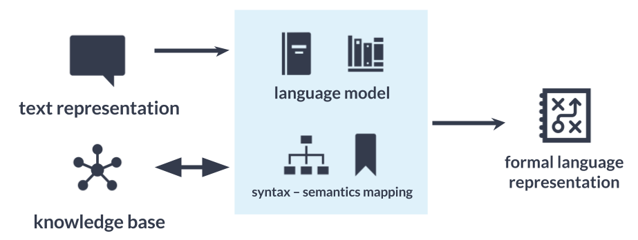

.. _The Dialog System Core:

**********************
The Dialog System Core
**********************

The Dialog System Core takes care of spawning, deleting and managing *Conversations*, initializing and providing all necessary static core features and services like the memory, the NLU, Statemachine, etc. to *Conversations*.
Its heart is the *ConversationManager*, which is accompanied by the external services of *Memory* and *NLU* and the *InputDevices* and *OutputDevices* which provide interfaces to communication channels which we call *World Interfaces*, since the Roboy Dialog System may interface the world through these.

.. image:: images/DialogSystem_Core.png
    :alt: Dialog System Core architecture

ConversationManager
===================

The ``roboy.dialog.ConversationManager`` is the central managing node for the Dialog System. It is the entry point of the program. When ``roboy.dialog.ConversationManager.main()`` is launched, it initializes all necessary modules and then enters control-mode, where it assumes a behaviour depending on the selected *InputDevice* in order to provide control over the *Conversations*.

**During the initialization phase** all components that are included in the Dialog System core are initialized. This especially includes the *NLU* (in form of a queue of several ``roboy.linguistics.sentenceanalysis.Analyzer`` classes) and *world interface* specific initializations ( *world interfaces* may for different reasons need a centralized initialization separate from the I/O devices which are used to communicate with them).

**In order to manage Conversations** it stores them by UUID, which is in the format "[world-interface-name]-[uuid-from-world-interface]", for example "telegram-aaaaaaaaaaaa". Then it provides an API consisting of methods that allow controlling the *Conversation* threads if you know their uuid. It allows creating and spawning new *Conversations* and restarting, stopping and pausing existing ones. Also it allows deregistering *Conversations* so they can properly be destroyed when they are over.

InputDevice & OutputDevice
==========================

The ``roboy.dialog.io.InputDevice`` and ``roboy.dialog.OutputDevice`` classes are interfaces that may be used to provide access to *World Interfaces* to the Roboy Dialog System. Their actual behaviour depends on the architecture of the system that should be interfaced.

**In order for input to be handled by the Conversations**, an implemnetation of ``roboy.dialog.io.InputDevice`` must provide a ``public Input listen()`` method. A *Conversation* Thread will call this function in order to recieve a new ``roboy.dialog.io.Input``. If no new input has been generated by the user, the thread should wait inside the ``listen()`` function until a new input is generated.

**To enable a Conversation to send output to a channel**, an implementation of ``roboy.dialog.io.OutputDevice`` must provide a ``public void act(List<Action> actions)`` which should process the different types of ``roboy.dialog.action.Action`` according to the capabilites of the communication channel.

NLU (Semantic Parser)
=====================

Semantic parser is used to translate text representation into formal language representation. The aim is to be able to process user utterances and react upon them.

roboy_parser is based on `SEMPRE <http://nlp.stanford.edu/software/sempre/>`. It is currently being modified to fulfill Roboy Dialog system needs.

Architecture
------------

Semantic parser is based on the language model and NLP algorithms that then apply rules to the utterance to translate it. Language model consists of:
- set of grammar rules,
- lexicon,
- training dataset.

General architecture can be seen on the diagram below.

For more information please refer to :ref:`The Roboy Parser`.

Memory (The memory module)
==========================

For more in-depth information please refer to :ref:`Roboy Memory`.

General design
--------------

To remember information about itself and its conversation partners, their hobbies, occupations and origin, a persistent Memory module has been implemented using the Neo4j graph database.

