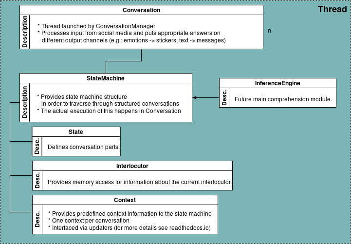
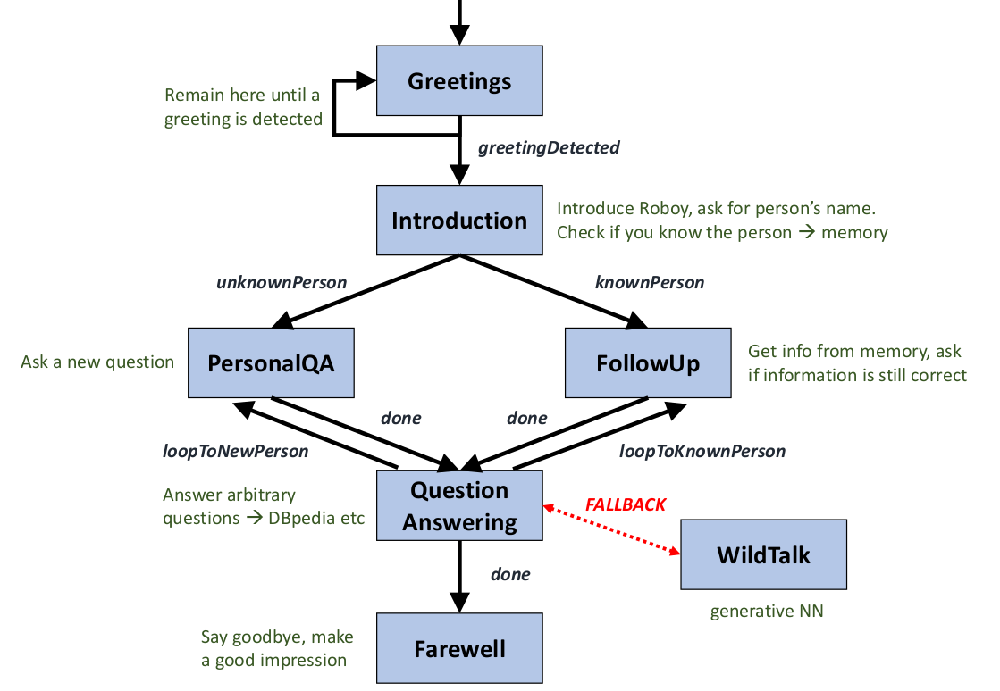
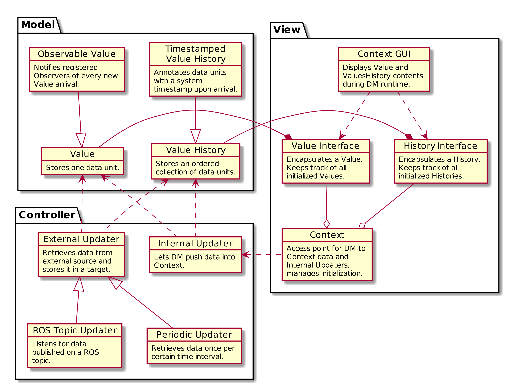

.. _Conversation:

************
Conversation
************

A *Conversation* is a concept for everything necessary for conducting a dialog with a single counterpart. It's task is traversing through the different states of the interaction with the user to provide a maximally human-like experience.
It recieves Input through it's *InputDevice* and uses this Input in combination with the *InferenceEngine* and the *StateMachine* to traverse through the correct *States* as defined in the configured *Personality*. If it needs or learns information about the counterpart of the dialog, it uses the *Interlocutor* (see :ref:`Roboy Memory`) to access the Dialog Systems *Memory*. If it needs to store or inquire information about the environment it is in it uses its *Context* for this.

StateMachine
============

The ``roboy.dialog.DialogStateMachine`` is the unpopulated base for ``roboy.dialog.StateBasedPersonality``. It is unique to each *Conversation*, as each dialog usually is in a different state. It holds the *InferenceEngine* and the *Context* for a *Conversation*, as it should be the only part of it, accessing these. Its task is to handle traversing through the *States* of a *Personality* whereas a ``StateBasedPersonality`` enhances the features of the ``DialogStateMachine`` by augmenting the state-traversing functionalities with interaction-specific non-state behaviour like detecting the end of a conversation.

.. _personality_and_states:

Personality and states
======================

Overview
--------

To enable a natural way of communication, Roboy's Dialog System implements a flexible architecture using different personalities defined in **personality files**. Each file represents a **state machine** and defines transitions between different **states**. This enables us to dynamically react to clues from the conversation partner and spontaneously switch between purposes and stages of a dialog, mimicing a natural conversation.

Personality
-----------

A personality defines how Roboy reacts to every given situation. Different personalities are meant to be used in different situations, like a more formal or loose one depending on the occasion. Roboy always represents one personality at a time. Personalities are stored in JSON personality files.

During one run-through, the Dialog System uses a single Personality instance (currently implemented in ``roboy.dialog.personality.StateBasedPersonality``) which is built on top of a state machine. This implementation loads the behaviour from a personality file that stores a representation of a state machine. Additionally, it is possible to define the dialog structure directly from code (as it was done in previous implementations).

As the conversation goes on, the state machine will move from one state to another consuming inputs and producing outputs. The outputs are always defined by the current active state.

State
-----

A state contains logic to control a small part of the conversation. It is a class that extends ``roboy.dialog.states.definitions.State`` and implements three functions: ``act()``, ``react()`` and ``getNextState()``.

State's activity can be divided into three stages. First, when the state is entered, the initial action from the ``act()`` method is carried out, which is expected to trigger a response from the person. After Roboy has received and analyzed the response (see semantic parser), the ``react()`` method completes the current state's actions. Finally, Roboy picks a transition to the next state defined by the ``getNextState()`` method of the current state.

State Output
------------
The ``act()`` and ``react()`` functions return a ``State.Output`` object. This object defines what actions Roboy should do at this point of time. Most important actions include:

- say a phrase
- say nothing
- end the conversation and optionally say a few last words

The ``Output`` objects are created using static factory functions inside ``act()`` or ``react()`` in a very simple way. For example, if Roboy should react with a phrase, the ``react()`` function could be implemented like this: ``return Output.say("some text here")``. Here, ``Output.say`` is the static factory function that creates an ``Output`` object.

To improve the dialog flow, you can add segues to the ``Output`` objects using ``outputObj.setSegue()``. A segue is a smooth transition from one topic to the next. It is also planned to add control over Roboy's face to the ``Output`` objects but this feature is not implemented yet.

State Transitions
-----------------

A state can have any number of transitions to other states. Every transition has a name (like "next" or "error"). When changing states, the following state can be selected based on internal conditions of the current state. For example, a state can expect a "yes/no" answer and have tree outgoing transitions: "gotYes", "gotNo" and "askAgain" (if the reply is not "yes/no").

When designing a new state, the transition names are defined first. The transition name should describe a condition and not another state. For example, a good name would be "knownPerson" (take this transition when you meet a known person) or "greetingDetected" (take this transition when you hear a greeting). In this case, the name only defines a condition and allows the transition to point to any state. In contrary, a bad name would be "goToQuestionAnsweringState" because it implies that no other state than QuestionAnsweringState should be attached to this transition. This breaks modularity.

Once the state is implemented, the connections between states are defined in the personality file. At run time the state machine loads the file and initializes the transitions to point to correct states. During the implementation, the destination state can be retrieved by the transition name using ``getTransition(transitionName)``.

It is possible to remain in the same state for many cycles. In this case the ``getNextState()`` method just returns a reference to the current state (``this``) and the ``act()`` and ``react()`` methods are carried out again. If ``getNextState()`` returns no next state (``null``), the conversation ends immediately.

Fallback States
---------------

Fallbacks are classes that handle unpredicted or unexpected input. A fallback can be attached to any state that expects inputs that it cannot deal with. In the case this state doesn't know how to react to an utterance, it can return ``Output.useFallback()`` from the ``react()`` function. The state machine will query the fallback in this case. This concept helps to keep the states simple and reduce the dependencies between them. When implementing the ``react()`` function of a new state, it is sufficient to detect unknown input and return ``Output.useFallback()``.

In the current Dialog System, we use special states to implement the fallback functionality. A fallback state never becomes active so only the ``react()`` function has to be implemented. This function will be called if the active state returned ``Output.useFallback()``.

State Parameters
----------------
Sometimes you want to pass parameters to the states, for example define a path to a file that contains some data. Parameters are defined inside the personality file. Each parameter has a name and a string value. When a state is created, the state machine passes all parameters from the file to the state constructor. Therefore, every state sub-class should have a constructor that accepts parameters matching the constructor of the ``State`` class.

During runtime, state objects can access the parameters using the ``getParameters()`` function with returns a ``StateParameters`` object. This object contains parameters from the personality file as well as references to ``StateMachine``, ``RosMainNode`` and ``Neo4jMemoryInterface`` in case you need them.

State Interface
---------------

When you create a new personality file you might forget to define important transitions and provide required parameters to some states. To prevent long debugging and find errors faster you can define an interface for every state. The interface describes:

- transitions that have to be set
- parameters that has to be provided
- whether a fallback is required for this state

After the personality file was loaded and the state machine was initialized, the dialog system will check if all states have everything they define in the state interface.

For every state, its interface is implemented by overriding three functions: ``getRequiredTransitionNames()``, ``isFallbackRequired()`` and ``getRequiredParameterNames()``. Note, that you don't have to override those functions if your state has no specific requirements.

Current standard Personality
----------------------------

Current standard personality is used to interact with a single person. After Roboy hears a greeting and learns the name of the person, he will ask a few personal questions and answer some general questions about himself or the environment.

Overview over Implemented States
--------------------------------

**PassiveGreetingsState**: Roboy is listening until a greeting or his name is detected (passive state to start a conversation).

**IntroductionState**: Roboy asks the interlocutor for his name, decides if the person is known and takes one of two transitions: knownPerson or newPerson.

**PIAState** (PersonalInformationAskingState): Roboy asks one of the personal questions (like 'Where do you live?') and updates facts in Memory.

**FUAState** (FollowUpAskingState): Roboy asks if the known facts are still up to date (like 'Do you still live in XY?').  This state is only entered if there are some known facts about the active interlocutor.

**QuestionAnsweringState**: Roboy answers questions about itself or some general questions. Answers are provided by the parser (from sources like DBpedia) or the Memory.

**WildTalkState**: This fallback state will query the deep learning generative model over ROS to create a reply for any situation.

**FarewellState**: Roboy ends the conversation after a few statements.

Context
=======

The goal of ``roboy.context.Context`` is to collect information about Roboy's or a conversation's environment and state. It is a per-dialoge structure and will only store contemporary information which will be lost when the conversation. If the Dialog System encounters information about this *Conversations* context, for example where this happens, a *Personality* might store this information here. Also external services may provide contextual information through the *Context*. This information can be used by the dialog manager and also to react upon situations that match certain conditions, such as turning the head of the Roboy when the Interlocutor moves or the last time a message from a user was recieved in a social-media setting.

Architecture
------------

The Context supports storing data as a ``Value`` or ``ValueHistory``. A ``Value`` only stores the latest data object that was pushed to it. A ``ValueHistory`` stores every value it receives and assigns each a unique key, thus the values can be ordered by their adding time. These may be accessed through ``Value Interface`` and ``History Interface`` implementations and may be changed through ``Updater`` implementations. For more information see :ref:`Using the Context`.

Inference engine
================

EXPERIMENTAL FUNCTIONALITY

The Inference Engine is one of the main future components of Roboy Dialog System.
Its main task is to process the data obtained from various analyzers and parsers to successfully infer
the expected set of actions and retrieve the meaningful bits of information as well as ground the references
from available ontologies and external sources.
