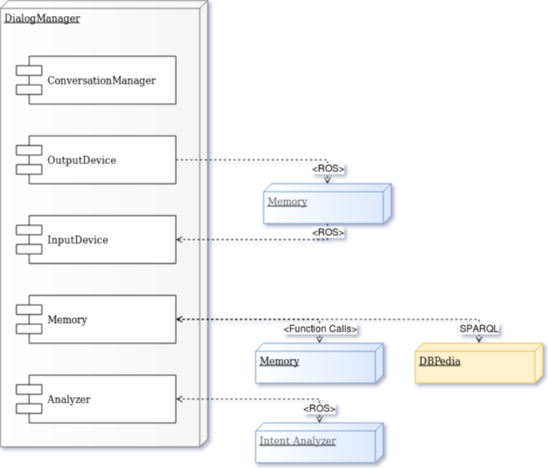

UML Diagrams
================

Deployment diagram
--------------------------

This diagram depicts the external modules and their communication channels/protocols with the Dialog Manager. Modules which are in development (intents, Memory) are included in gray. For simplicity, the Dialog Manager module only contains these components which are most relevant for external connections.

Building block diagram
--------------------------

This diagram depicts the internal modules of the Dialog System and their dependency hierarchies.

.. figure:: images/buildingblock.png
:alt: Building block diagram

Sequence Diagrams
--------------------------

This is a simple high-abstraction sequence of the Dialog Manager's workflow, starting at the initialization and going from registering input over interpretation and action generation to sending output actions.

.. figure:: images/sequence.png
:alt: Sequence diagram

